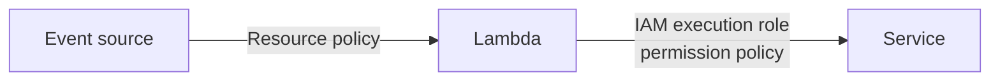
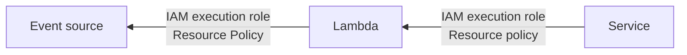
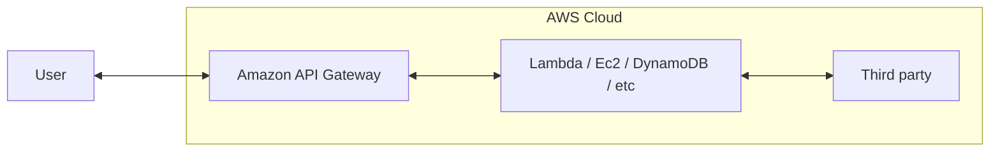

# Day 2

## Module 7: Getting Started with Databases

### AWS database services

- Relational DBs
  - Amazon Relational Database Service (RDS)
    - Amazon Aurora
    - PostgreSQL
    - MySQL
    - MariaDB
    - Oracle
    - Microsoft SQL Server
  - Amazon Redshift
- NonRelational DBs
  - Amazon DynamoDB
  - Amazon ElastiCache
  - Amazon Neptune
- Additional AWS database services
  - Amazon DocumentDB (with MongoDB compatibility)
  - Amazon Keyspaces ( for Apache Cassandra )
  - Amazon Timestream
  - Amazon Quantum Ledger Database

#### Relational

- stores in tables that are related to each other via primary key/foreign key relationship
- supports complex queries/joins
- The schema of a relational db is defined in the beginning
  - changes to the schema requires migration of data
- Data is queried by query language (SQL)
- supports vertical scaling (single server)
- supports ACID (atomicity/consistency/isolation/durability) transaction
- supports strong data consistency automatically because of the ACID properties

#### NonRelational

- support wide-column stores / document stores / key-value stores / graph stores
- do not have a fixed schema
- queries data by focusing on collections of documents
- support horizontal scaling
  - you can partition and spread data across multiple, less costly servers instead of purchasing powerful servers
- high performance with eventual consistency

### Why choose Amazon DynamoDB?

- Performance at scale
  - Fully managed NoSQL, fast, predictable performance, scalable
- Serverless
  - does not require you to install or maintain any software
- Enterprise Ready
  - Fast and flexible
- Fully managed
  - Hardware of software provisioning
  - Setup and configuration
  - Software patching
  - Operating a distributed database cluster
  - Partitioning data over multiple instances
- Low-letency queries
  - automatic partitioning and solid state drives (SSD) technologies
- Fine-grained access controls
  - integrates with IAM
  - unique security credentials to each user
- Flexible
  - can be acced by AWS SDK

### Dynamo DB

#### Basics of items

- **Partition Key** (required)
  - consists of a single attribute, the partition key.
- **Sort Key** (optional)
  - partition key attribute
  - sort key attribute
- **Attributes**

#### Data types

- **Scalar types**: Number(0-9), String(''), Binary(0/1), Boolean(true/false), and Null
- **Multi-valued types**: String Set, Number Set, and Binary Set
- **Document types** - List(arr) and Map(obj)

#### Read & Write throughput

- Read Capacity Unit (RCU)
  - Number of strongly consistent reads per second of items up to 4KB in size
    - e.g. 1 strongly consistent RCU = reads 4kb/sec
  - Eventually consistent reads use half the provisioned read capacity
    - e.g. 0.5 eventually consistent RCU = reads 4kb/sec
    - e.g. 1 eventually consistent RCU = reads 8kb/sec

###### :fire: Exam Tip

```
Question: I require 37kb/seconds data read using eventually consistent reads.
Answer: I will need 5 eventually consistent RCU (5 RCU * 8 = 40kb/sec)
```

- Write Capacity Unit (WCU)
  - 1-kb writes per second

##### Global Secondary Index

- can contain different information
- key values do not need to be unique
- can be created when a table is created or to an existing table
- can be deleted
- supports eventual consistency only
- has own provisioned throughput settings for RCU/WCU
- queries return only attributes that are projected into the index

##### Local Secondary Index

- same as table's partition key
- can be created only when a table is created
- cannot be deleted
- supports eventual/strong consistency
- does not have its own provisioned throughput. It uses table's RCU/WCU
- queries can return attributes that are _not_ projected into the index

##### Adaptive capacity

- enables your Dynamo DB table to run imbalanaced workloads
- minimizes throttling and helps reduce costs by enabling you to provision only what you need and not for spikes
- Read [this guide](https://docs.aws.amazon.com/amazondynamodb/latest/developerguide/bp-partition-key-design.html) for more information

### Accesing DynamoDB

- AWS Management Console (UI)
- NoSQL Workbench(GUI App)
  - supports DynamoDB/Amazon Keyspaces
  - supports PartiQL
- DynamoDB Local
  - local set up
- PartiQL
  - SQL-compatible query language
- AWS CLI
- SDKs (low-level/document/high-level interface)
- AWS API

#### DynamoDB using AWS CLI

```bash
aws dynamodb list-tables --endpoint-url http://localhost:8000
aws dynamodb put-item --table-name Notes --item {...}
```

#### DynamoDB using SDK

- Object persistenct Interface (High-Level)
  - Data types are mapped
  - Java, .NET
  - Object-centric code
- Document Interface
  - Data types descriptors are implied
  - Java, .NET, Node, Javascript
  - Built in JSON tools
- Low-Level Interface
  - Data types descriptors must be identifed
  - Supports all AWS SDKs

#### DynamoDB using REST API (Requests & Responses)

```HTTP
# Request Example (Get Item)
POST / HTTP/1.1
Host: dynamodb.<region>.<domain>;
Accept-Encoding: identity
Content-Length: <PayloadSizeBytes>
User-Agent: <UserAgentString>
Content-Type: application/x-amz-json-1.0
Authorization: AWS4-HMAC-SHA256 Credential=<Credential>, SignedHeaders=<Headers>, Signature=<Signature>
X-Amz-Date: <Date>
X-Amz-Target: DynamoDB_20120810.GetItem

{ "TableName": "Notes", "Key": { "UserId": {"S": "StudentA"}, "NoteId": {"N": "1"}}}
```

```HTTP
# Response Example
HTTP/1.1 200
OK x-amzn-RequestId: <RequestId>
x-amz-crc32: <Checksum>
Content-Type: application/x-amz-json-1.0
Content-Length: <PayloadSizeBytes>
Date: <Date>

{ "Item": { "UserId": {"S": "StudentA"}, "NoteId": {"N": "1"}, "Note": {"S": "HelloWorld!"}}}
```

## Module 8: Processing your Database Operations

- Control Plane Operations
  - Create/Describe/List/Update/Delete Table
- Data Plane Operations
  - CRUD actions on data in table

### Designing the database

#### What are the application's needs?

- Data size
  - how much data will be stored and request at one time?
- Data shape
  - this is a key factor in increasing speed/scalability
- Data velocity
  - DynamoDB scales by increasing the number of physical partitions
  - what is the peak query loads?
  - think of RCU/WCU

#### Partition key design

- Select your partition key by:
  - Common access patterns
  - High cardinality
  - Well known to the application
- Use secondary indexes
- Keep related data together
- Use sort order
- Distribute queries

```
Example:
I need Notes and Users.
I want to get all Notes by a User

Table 1 Partition Key : NoteId

Table 2 Partition Key : UserId
        Sort Key      : NoteId
```

#### Choosing initial throughput (RCU/WCU)

- item sizes
- expected read/write rate
- read consistency requirements
- predictable / unpredictable traffic
- known / unknown workloads

```
Example:
If the size is 2kb per item
It requires 2kb item size / 4KB = 1 consistency RCU
It requires 2kb item size / 1KB = 2 WCU
```

### Using the DynamoDB

#### Using the AWS SDK

```cs
# .NET Example of creating a table

KeySchema = new List<KeySchemaElement>()
{
    new KeySchemaElement
    {
        AttributeName = "UserId", KeyType = "HASH" // Partition key
    },
    new KeySchemaElement
    {
        AttributeName = "NoteId", KeyType = "Range" // Sort key
    }
},

ProvisionedThroughput = new ProvisionedThroughput
{
    ReadCapacityUnits = 5, WriteCapacityUnits = 5
}
};

var response = client.CreateTable(request);
```

```cs
# Example of .NET updating the table throughput

string tableName = "Notes";

var request = new UpdateTableRequest()
{
    TableName = tableName,
    ProvisionedThroughput = new ProvisionedThroughput()
    {
        ReadCapacityUnits = 20,
        WriteCapacityUnits = 10
    }
};

var response = client.UpdateTable(request);
```

```cs
# Example of .NET Object persistence model (High-Level)

[DynamoDBTable("Notes")]
public class NotesItems
{
    # Explicit mapping
    [DynamoDBHashKey]           # Hash (Primary) key for the table
    public string UserId { get; set; }

    [DynamoDBRangeKey]          # Range (Sort) key for the table
    public int NoteId { get; set; }

    [DynamoDBProperty("Tags")]  # Remapping the class property to table attribute
    public List<string> NotesTags { get; set; }

    [DynamoDBIgnore]            # This gets ignored and doesn't get mapped
    public string NotesData { get; set; }

    public string Notes { get; set; } # Default mapping


    public string ToJson()
    {
        return JsonSerializer.Serialize(this);
    }
}

var ddbContext = new DynamoDBContext(ddbClient);
await ddbContext.LoadAsync<Note>(userId, noteId);
await ddbContext.SaveAsync(note);
```

#### Using the AWS CLI

```bash
# Create table
aws dynamodb create-table --cli-input-json file://notestable.json --region us-west-2

# Get Item
aws dynamodb get-item
    --table-name Notes
    --key {...}

# Querying Data
aws dynamodb query
    --table-name Notes
    --key-condition-expression "UserId = :userid"
    --expression-attribute-values '{":userid":{"S":"StudentA"}}'

# Creating item
aws dynamodb put-item
    --table-name Notes
    --item {...}

# Batch creating item
aws dynamodb batch-write-item --request-items file://request-items.json

# Updating item
aws dynamodb update-item
    --table-name Notes
    --key '{...}'
    --update-expression "..."
    --expression-attribute-values '{...}'
    --condition-expression "..." # conditional write
    --return-values ALL_NEW

# Deleting item
aws dynamodb delete-item
    --table-name Notes
    -- key {...}
```

##### Paginating results

DynamoDB returns only 1MB in size or less. Check for `LastEvaluatedKey` to determine if there are more results. Use the value of `LastEvaludatedKey` as `ExclusiveStartKey` in the new query.

##### Scanning data

Reads every item in a table or a secondary index. This consumes the same amount of read capacity regardless of whether a filter is expression is present.

> Query vs Scan
>
> Scans are less efficient than queries but often are the only solution.

##### Parallel scans

- Use parallel scan to scan multiple tables at once
- the larger the table or index being scanned, the more time the scan takes to complete
- divides table/secondary index into segments and scans in parallel
- [More information](https://docs.aws.amazon.com/amazondynamodb/latest/developerguide/Scan.html#Scan.ParallelScan)

### Caching

Amazon DynamoDB Accelerator (DAX) vs Amazon ElastiCache

- DAX
  - fast response times for accessing eventually consistent data.
  - reduces the response times of eventually consistent read workloads
- ElastiCache
  - can use to deploy /run Memcached or Redis protocol
  - improves the performance of web applications
  - can retrieve information from a fast/managed/in-memory system

###### :fire: Exam Tip

```
Question : Multi-threading cache?
Answer: MEM Cache

Question : No multi-threading cache?
Answer: Redis
```

## Module 9: Processing your application Logic

### Types of computing in AWS

- Instances
  - **Amazon EC2**: Scalable computing capacity
    - Packaging: Amazon Machine Image (AMI)
    - Pricing: Consumption based
    - Scalability: Can be configured to scale
- Containers
  - **Amazon ECs**: Fully managed container orchestration
  - **Amazon EKS**: Fully managed container orchestration with Kubernetes
    - Packaging: Containers
    - Pricing: Consumption based
    - Scalability: Can configured to increase number of instances
- Serverless
  - **AWS Lambda**: Event-driven serverless compute
    - Packaging: Function Code
    - Pricing: Pay per request
    - Scalability: Implicit scaling

### AWS Lambda

#### Invoking Lambda

- **Events**
  - Amazon SNS/SES/EventBridge...
  - Amazon S3/DynamoDB/Kinesis/Cognito...
- **HTTP requests**
  - Amazon API Gateway/IoT/Alexa...
- **API calls**
  - AWS SDK

#### Anatomy of Lambda

- Access Permissions & Triggers
  - Who with which policy can trigger lambda?
- Configuring Lambda
  - Concurrency
  - Memory
  - Timeouts
- Code
  - Handler function is called by the service
- Runtime
  - Which language to write lambda in
  - e.g. Java, .NET, Node, Python...
- Layers (reuse/share code)

#### Ways to invoke Lambda functions

- Synchronous invocation (direct invocation)
  - Amazon API Gateway -> Lambda
  - No retries
- Asnychronous invocation (Push)
  - Amazon S3/Simple Notification Service(SNS) -> Event queue -> Lambda
  - requires to be implemented with retry on error
  - built in retries (2x)
- Poll-based (pull)
  - Amazon Kinesis/DynamoDB -> streams/batches -> Event source mapping -> Lambda
  - retries depends on event sources

#### Lambda runtime lifecycle

```
|-------------Cold start----------------------|    |--Warm start--|
[ Download Code ] -> [ Initialize environment ] -> [    Invoke    ] -> [ Shutdown ]
* Function              *Extensions                 *Run function       *Alert extensions
* Layers                *Boostrap runtime            handler            *Remove environment
                        *Run function initialization
```

- New invocation requests are processed with an available lambda runtime environment.
  - If a runtime is not available/busy, a new runtime is created
- All requests are limited to 15 min (900s) of running time.
- The default timeout is 3seconds

##### Minimizing cold starts

- Schedule a lambda function
  - Create a rule to run a function at a specific interval
- Provisioned concurrency
  - Initialize the specified number of lambda runtime envrionment
  - e.g. multiple runtimes waiting for the events

#### Permissions (Invocation & Processing)

##### Invocation permissions

- permission required to communicate with your lambda function
- grant these permissions using the execution role or resource policies

Push or direct invocation model



Pull or polling invocation model



##### Processing permissions

- permission required to access other AWS resources in your account
- grant these permissions by creating IAM role (`execution role`)

#### Lambda function: Handler

When Lambda function is invoked, the handler code runs. You specify the handler when creaing a lambda function

- A handler receives two arguments:
  - Event Object
    - Data sent during invocation
      - e.g. API Gateway event will contain details related to the HTTPS request made by the API client
  - Context Object
    - Information about the current runtime environment
      - AWS RequestId
      - Timeout
      - Logging

```json
// Example: Amazon S3 Event

{ "Records": [
    { "eventVersion": "2.1",
        "eventSource": "aws:s3",
        "awsRegion": "us-east-2",
        "eventTime": "2019-09-03T19:37:27.192Z",
        "eventName": "ObjectCreated:Put",
        "userIdentity": { "principalId": "AWS:AIDAINPONIXQXHT3IKHL2" },
        "requestParameters": { "sourceIPAddress": "205.255.255.255" },
        "responseElements": { "x-amz-request-id": "D82...",
            "x-amz-id-2": "vl...=" },
        "s3": { "s3SchemaVersion": "1.0",
            "configurationId": "828...",
            "bucket": { "name": "notes-bucket",
                "ownerIdentity": { "principalId": "A3I..." },
                "arn": "arn:aws:s3:::lambda-artifacts-dea..."
            },
            "object": { "key": "b2...", "size": 1305107, "eTag": "b21...", "sequencer": "0C0F6F405D6ED209E1" }
        }
        }}]}
```

```cs
# Function handler (C#)
myoutput HandlerName(MyEvent event, ILambdaContext context) {...}

# Example
using system.IO;
namespace Example
{
    public class Hello
    {
        public Stream MyHandler(Stream stream)
        {...}
    }
}
```

```bash
# Example: AWS CLI create function
aws lambda create-function
    --function-name dictate-function
    --handler app.lambda_handler
    --runtime python3.8
    --role arn:aws:iam::.....:role/lambdaPollyRole
    -- environment variable={TABLE_NAME=$notesTable}
    --zip-file fileb://dictate-function.zip

# Example: AWS CLI update function configuration
aws lambda update-function-configuration
    --function-name my-function
    --environment "Variables={BUCKET=my-bucket, KEY=file.txt}"
```

#### Versioning Lambda

- the version number is incremented and the earlier version is stored
- can publish one or more versions of Lambda functions
- each versions should have unique ARN

```
                                          |--function name-|
arn:aws:lambda:aws-region:acct-id:function:dictate-function:${ENVIRONMENT-VARIABLE}
        |---------Partial ARN------------------------------||------Qualifier------|

arn:aws:lambda:aws-region:acct-id:function:dictate-function:Test
arn:aws:lambda:aws-region:acct-id:function:dictate-function:Prod
```

#### Sharing code with layers

- a layer is a .zip file archive that contains code that is beyond the business logic (e.g. libraries/custom runtimes/other dependencies)
- with layers, you can share code across different versions of the same function or across multiple functions in a workload
- each time a new layer is published, the version number increments
- you can include up to five layers per function, which count towards the standard lambda deployment size limits

#### Testing & Debugging Lambda

- separate shared dependencies and upload them as a layer to test effectively
- Objectives
  - Memory Performance
  - Timeout tests
  - Find out limits
- you can test by:
  - AWS Management Console (UI)
  - AWS CLI
  - AWS SDKs
  - AWS Serverless Application Model (AWS SAM)

```bash
aws lambda invoke
    --function-name dictate-function
    --payload '{...}'
    response.txt #this will the output saved on to local machine
```

#### Deploying Lambda

- Packaging considerations
  - minimize your deployment package size to its runtime necessities
    - reduces the amount of time of deployment
  - minimize the complexity of your dependencies
    - loads quickly on execution context startup
- Lambda supports two types of deployment packages
  - Container image
    - Docker image manifest V2
    - Schema 2 (Docker v1.10 <=)
    - OCI specifications (v1.0.0 <=)
  - Zip package

## Module 10: Managing the APIs

### Amazon API Gateway

#### HTTP & REST APIs

- AWS service for creating/publishing/maintaining/monitoring/securing REST HTTP, and WebSocket APIs
- Use API Gateway to access AWS services or third-party services.
- a REST API in API Gateway is a a collection of HTTP resources and methods that are integrated with:
  - backend HTTP endpoints
  - lambda
  - other AWS services



#### WebSocket APIs

- Bidirectional APIs
  - With API Gateway, you can create a WebSocket API as a stateful frontend for an AWS service or for an HTTP endpoint.
- Routes
  - The API Gateway calls a route under the following conditions:
    - $connect route
      - when a persistent connection between the client and a WebSocket API is being initiated
    - $disconnect route
      - when the client / server disconnects from the API
    - $default route
      - if the route selection expression cannot be evaluated against the message
      - if no matching route is found
    - Custom route

#### Features

- Host multiple versions
- Configure API keys
  - can configure usage plans and API keys to allow customers to access selected APIs
- Throttle limits
  - server-side throttling limits prevents your API/account from being overwhelemd by too many requests
  - per-client throttling limits are applied to clients that use API keys associated with your usage policy as client identifier
- Control and manage access
  - IAM role and permissions
- Data transformations
- SDK generation
- Mock integrations
- Response caching

#### Core components of a REST API

- API Gateway REST API is made up of:
  - `resource`
    - logical entity that an application can access through a resource path
    - e.g. `/notes`
  - `method`
    - REST API request that is submitted by the user of your API and the response returned to the user
    - e.g. `GET`

```HTTP
#Example

GET https://{api-id}.execute-api.{region}.amazonaws.com/notes
```

#### Types of integrations

- Proxy `AWS_PROXY`/`HTTP_PROXY`
  - Flexible/versatile/streamlined integration setup
  - You do not set the integration requests/response
  - No options to modify passthrough behaviours
- Non-proxy `AWS`/`HTTP`
  - You are responsible for data mapping
  - You must configure both integration request/response
  - You can choose passthrough behaviours
- Mock `MOCK`
  - Useful for API testing
  - Returns a mock response without sending request to the backend

#### Models

- defines the data structure of a payload
- with API Gateway, you can use mapping templates(Velocity Template Language VTL) to map the payload in the following ways:
  - from a `method request` to the corresponding `integration request`
  - from an `integration response` to the corresponding `method response`

```json
//Example of mapping template

#set($inputRoot = $input.path('$'))
{
    "Environment": "$stageVariables.environment",
    "Notes": [{
        "NoteId": "$elem.NoteId",
        "Note": "$elem.Note"
    }]
}

```

#### APIs with Swagger

- import API designs
- export API designs
- faster development
- complex configurations
- store and reuse

#### Test Integrations

```bash
# Example of AWS CLI invoke to test
aws apigateway test-invoke-method
    --rest-api-id xxxxxx
    --resource-id xxxxxxxx
    --http-method GET
    --path-with-query-string '/'
```

You can create a mock integration. By doing so you can:

- Test without a completed backend
- Test scenarios
- Speed up API development

#### Deploying API Gateway

```HTTP
# Example of REST APIs invoke to deploy API Gateway

https://{restapi_id}.execute-api.{region}.amazonaws.com/{stage_name}/
```

##### Stage Variables

- name-value pairs that you can define as configuration attributes
- act like environment variables

Use cases:

- have multiple data sources
- manage multiple release stages
- pass configurations to lambda functions

Example:

1. Set a stage variable in a stage configuration
2. set the value as the URL string of an HTTP integration for a method in your REST API
3. reference the URL strihng by using the stage variable!

##### Canary release (Similar to flags)

A canary release is a software development strategy in which a new version of an API or other software is slowly rolled out as a new/testing version of an existing application.

- reduce risk of deployments
- test performance
- develop in parallel

How to:

1. Make a feature change
2. Deploy to the new stage
3. If necessary:
   - Enable caching
   - Set stage variables
   - enable logging with CloudWatch
4. Enable canary on new stage
5. Set the percentage of requests to canary (e.g. 10% to new stage)
6. Re-deploy APIs to the canary-enabled stage (Roll out!)
7. Promote canary (e.g. 100% to new stage)
