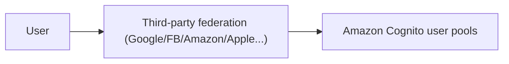
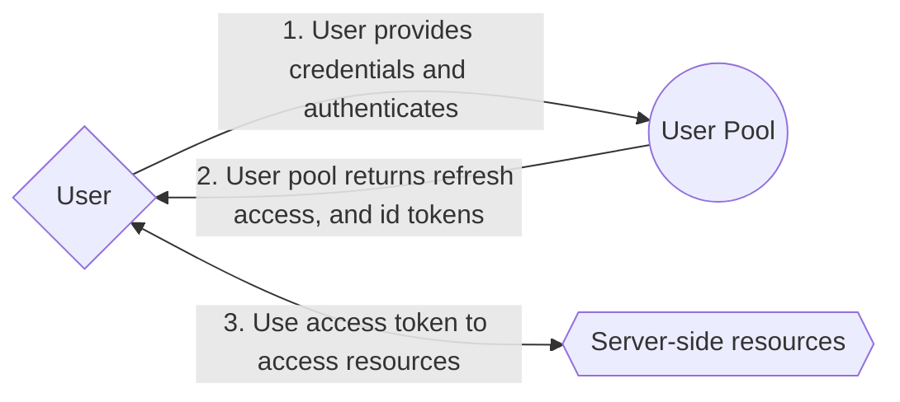
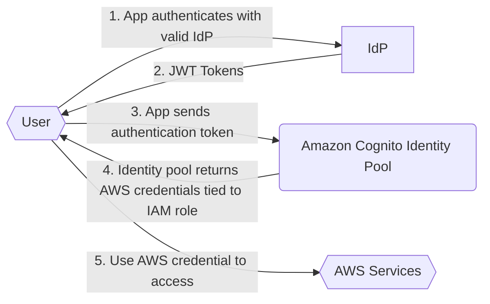
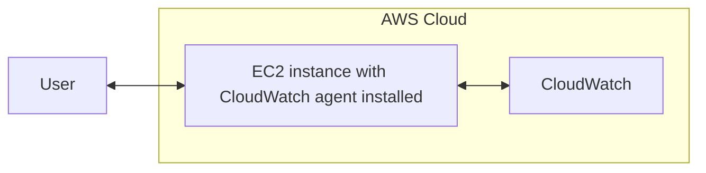
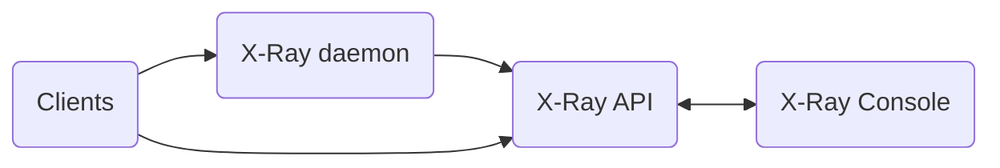

# Day 3

## Module 11: Building a modern application

### Architectural patterns: Microservices

#### Characteristics

`Speed` | `Scale` | `Resilience` | `Security`

#### Monolith vs Microservice

- Monolith
  - does everything
  - tightly coupled functionality
  - single tech stack
  - limited data options
  - deployment complexity
- Microservice
  - minimal function services
  - tightly scoped
  - strongly encapsulated
  - loosely coupled
  - independently deployable
  - scalable

#### Benefits of Microservice architecture

- Development agility
  - readable, easier to change, better collaboration
- Fast & independent deployments
  - deployed independently, quicker, and easier
- increased security
  - each service is secure
- independent scaling
- incrased availability and resilience
  - fault isolation is improved
- organized based on business capabilities

##### Culture of ownership: Domain-Driven

- Functionality of microservice is within the context of the domain
- Defines the integration points with other domains

#### Interaction patterns

##### API-Driven

- Synchronous processing
- App <--> Services through APIs
- HTTP & HTTPS communication protocol

##### Event-Driven

- Asnychronous processing
- A message prepresents something has happened
- Provider generates an event
- Consumer subscribers to an event
- e.g. "When a file is put into S3, run Lambda function"

### Software delivery: DevOps

- **Monolithic** will work on a single service with a single delivery pipeline.
- **Microservices** will work on multiple services with delivery pipeline for each services

### Operation Model: Serverless

By going to serverless, you no longer have to :

- ~~provision an instance~~
- ~~update the OS~~
- ~~install the application platform~~
- ~~configure auto scaling and load balancing~~
- ~~continuously patch,secure, and monitor servers~~

Only focus on:

- Build and deploy applications
- Monitor and maintain applications

#### Benefits

- Don't pay for idel. Request-based pricing
- No infrastructure to provision/monitor/manage
- Sacling & fault-tolerance are built in
- Easier to author/deploy/secure
- Enables best practices (events/stateless functions)

#### Available AWS Serverless App Stacks

- **Compute**: Lambda / Fargate
- **API Proxy**: API Gateway / AppSync
- **Analytics**: Kinesis / Athena
- **App integration**: SNS / SQS / EventBridge
- **Dev Tools**: AWSCLI / SDKs
- **Storage**: S3 / EFS
- **DB**: DynamoDB / Aurora
- **Orchestration**: Step Functions
- **Visibility**: CloudWatch / X-Ray

## AWS Step Functions

#### Orchestration of business logic

Serverless app can become complex. You can use **AWS Step Functions** to handle:

- business logic
- failures / retries / parallelization
- service integrations
- timeouts

#### Using AWS Step Functions

1. Define
   - Use Amazon States Language ([ASL](https://states-language.net) similar to JSON)
   - Use Workflow Studio (UI)
2. Visualize
3. Run & Monitor

#### Anatomy of the Task state

```
[State input] > [InputPath] -> [Parameters] -> [State] -> [ResultPath] -> [OutputPath] -> [State Output]
```

Step Functions invoke the task and pauses until the task is completed. It can be integrated with multiple AWS services.

## Module 12: Granting Access to your application users

### AWS Cognito

Amazon Cognito is the solution for the authentication and authorization needs of applications.

#### Authentication & Authorization

- Authentication
  - verify the users who they say they are
    - e.g. login / SSO / 2FA/MFA / 0AUth / Tokens(JWT) etc.
- Authorization
  - can the user perform the desired action?
    - e.g. does the user have these policies: canPostNotes / canEditNotes / canDeleteNotes?

#### Features

- Identity store
  - users can sign in through Social identity providers like Google/Facebok/Apple etc.
- Access control
- Integration with
  - AWS services
  - external identify providers(idPs) e.g. Google/Facebook/Apple etc.
- Security
  - Payment card industry (PCI) data security standards (DSS)
  - System and Organization Controls (SOC)
  - Standards-based authentication (0Auth 2.0, SAML2.0, OpenID Connect)
  - MFA

#### Components of Amazon Cognito

- User Pool
  - Authentication: Sign-up/Sign-in
  - Manage user directory
  - Standard tokens
- Identity Pool
  - Authorization: Grand users access to other AWS services
  - AWS credentials
  - Federated identities
  - Unauthenticated guests

> Users can sign up (even through third-party federation), sign in, or gain access to services.

###### :fire: Exam Tip

```
Question: what is the difference between User Pool and Identity Pool?
Answer: User Pool is authenticates the user, Identity Pool authorizes the user
```

##### Using third-party federation

Third-party federation is supported for both user pools and identity pools



#### Attribute / Scope / Groups

- Attributes: metadata of individual users
  - e.g. `Email` / `Name` / `Nickname`/ `Picture`
- Groups: represents different types of users
  - e.g. `Standard` / `Admin` / `ReadOnly`
- Scope: Level of access to resource
  - e.g. `ReadNotes` / `WriteNotes`

#### Flow of Amazon Cognito

1. Configuring level of access
2. Assign attributes/group/scope
3. Amazon cognito issues tokens
   - JSON Web Token(JWT)
     - Header
     - Payload
     - Signature
4. Use the application

##### Authenticate users with a user pool



##### Identity pools for Temporary access



#### Using AWS CLI

```bash
# Signing up with cognito-idp
# Note: $AppClients are the user pool authentication resources attached to the app. Example: 'q0b4jfb55hk9qgfminfr5g8jb'

aws cognito-idp sign-up --client-id $AppClientId --username $USERNAME --password $PASSWORD

# Confirm user signed up
# Note: $CognitoPoolId is the User pool ID. Example: 'us-east-1_5vpvPCCPl'
aws cognito-idp admin-confirm-sign-up --user-pool-id $CognitoPoolId --username $USERNAME

```

## Module 13: Deploying your application

> Traditional software release risks
>
> - Inconsistent packaging
> - Inconsistent software deployments
> - Difficult upgrades
> - No plan for rollbacks
> - Human errors
> - Manual approval gates

### DevOps

#### Culture

- Focus on customer needs
- Create a highly collaborative environment
- Continuously experiment and learn
- Include security everywhere
- Automate when possible
- Develop small
- Release often
- Continously improve

#### Practices

- CI / CD
- Microservices
- Infrastructure as code
- Monitoring and logging
- Communication and collaboration

#### AWS tools

- AWS CodeArtifact
  - Cost-effective software artifact management
- AWS CodePipeline
  - Automate continuous delivery pipelines
  - Orchestrates CodeCommit/CodeBuild/CodeDeploy
    - AWS CodeCommit
      - Git repositories on AWS
    - AWS CodeBuild
      - Build and test code pay-as-you-go model
    - AWS CodeDeploy
      - Automate code deployments
- AWS Cloud9
  - Cloud IDE
- AWS Config
  - Assess/audit/evaluate the confgs of AWS resources
- AWS CloudFormation
  - create/manage a collection of related AWS & third-party resources
- AWS CloudWatch
  - Collect/access/correlate data from across AWS resources
- AWS X-Ray
  - Analyze and debug production/distributed applications

### AWS Serverless Application Model (AWS SAM)

AWS SAM is an open-source framework used to deploy serverless applications.

#### Components

- AWS SAM template specification
- AWS SAM CLI
  - Create / Build / Test / Deploy applications

#### Project structure

```
sam-app/
  |-READMD.md
  |-some_lambda_function/
         |-__init__.py
         |-app.py
  |-some_lambda_function/
         |-__init__.py
         |-app.py
  |-template.yaml <---- SAM Template
```

#### Installing the AWS SAM CLI

1. Create an AWS account
2. Configure IAM permissions and AWS credentials
3. Install Docker to test app locally (optional)
   - `sam local invoke`: Run Lambda function locally in a docker container
   - `sam local start-api`: Replicate Amazon API Gateway endpoint locally
   - `sam local generate-event`: Generate sample payloads from different event sources
4. Install AWS SAM CLI

#### Workflow

1. `sam init` : Initialize a new AWS SAM project
   - Select `Start Template` or `Custom Template`
2. `sam build` : Builds SAM application. You can build inside a container
3. `sam local invoke "FunctionIWantToRun" -e event.json` : Runs SAM application for locally testing purposes
4. `sam deploy` : Deploys SAM application

#### Deployment strategies

- Canary: Specified percentage traffic in interval/minutes
- Linear: Incremental percentage traffic in interval/minutes
- All-at-once: All traffic shifted

###### :fire: Exam Tip

```
Question: What are the differences between Canary/Linear deployment strategies?
```

## Module 14: Observing your application

### Observability

#### Observability vs Monitoring

> **Observability** is the ability to observe, understand, and use data.
>
> **Monitoring** is the actual taks of displaying the data to make it observable in real-time

- Collect
  - Metrics and logs from AWS resources/applications/services
- Monitor
  - Displaying the data to make it observable in real-time
- Act
  - Automate responses to operational changes
- Analyze
  - Understand your system's state to provide context to aid monitoring

#### Observability plan

- Visibility: How is my application/resources doing?
- Real-time troubleshooting: What is happening with your code deployments
- Customer experience: What the issues and what to debug before they affect customers
- Performance = Identify latency issues => Revenue

#### Logging & Metrics & Tracing

- Logging
  - Record of events in an application
  - Use CloudWatch Logs
- Metrics
  - Numerical representation of data used to analyze the performance & behaviour of a system
  - Use CloudWatch metrics
- Tracing
  - identifying user's bottlenecks and improving the performance
  - Use AWS X-Ray

### Amazon CloudWatch (Logs / metrics)

- monitors resources
- collects metrics
- provides visibility in real-time

#### Key Components

- **Metrics**: data about the performance of your systems
- **Dimensions**: name-value-pair that is part of the identity of a metric
- **Alarms**: watch a single metric over a specified time period and perform actions based on the metric
- **Logs**: record of activity recorded by the application/resource being monitored
  - Supported Logging protocols:
    - Apache log4net
    - Pache Log4j
    - Nlog
    - Serilog

#### Configuring your application with CloudWatch



- SDK protocols
- CloudWatch agent (EC2/Lambda)
- AWS CLI

```bash
# Example of AWS CLI attaching CloudWatch metric

aws cloudwatch put-metric-alarm
    --alarm-name NotesWriteCapacityUnitesLimit
    --period 60
    --treat-missing-data missing
    --datapoints-to-alarm 5
    ...
```

### Amazon X-Ray

- Collects requests data
- Displays filtered data
- Traces requests to applications
  - identify and troubleshoot the root cause of performance issues/errors


