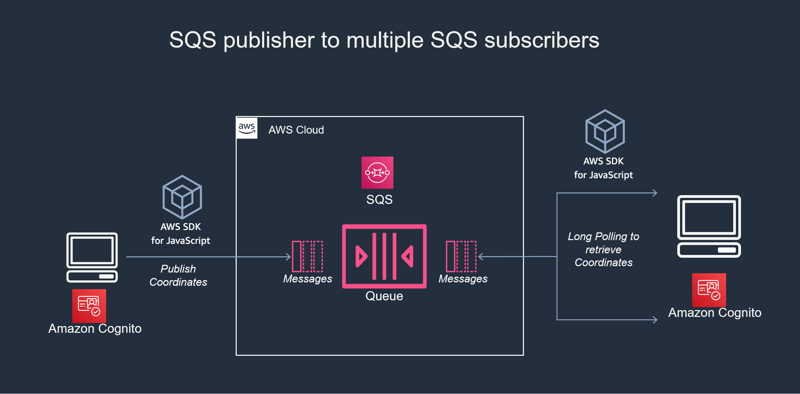
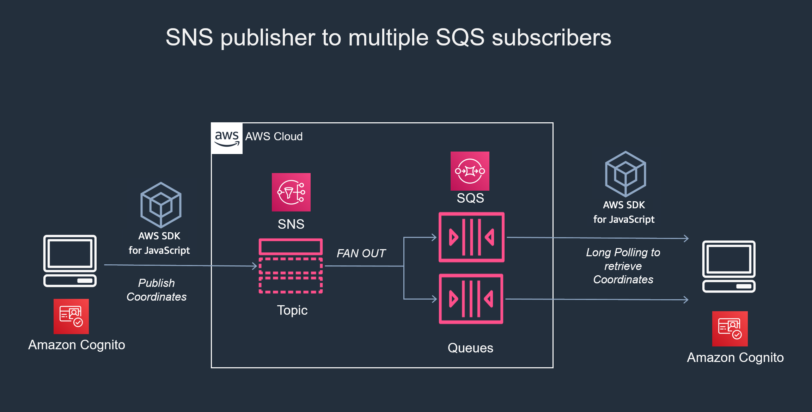
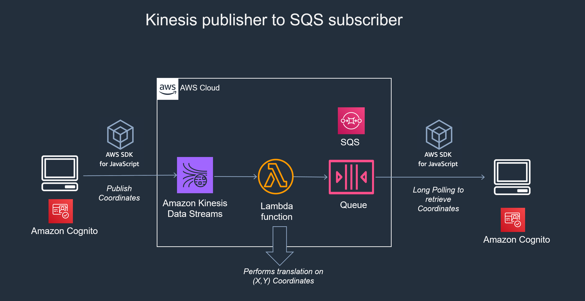

# Resilience & Scale

>The more you decouple the more scalability it gets

## Decentralized data stores

Independently scale, independently change schema
- Keep your services talking to its own data (RDS/DynamoDB/Neptune etc.)
- Its upto the consuming service to shape the data and store it itself
  - e.g. `CustomerService` sends `customerData` to `OrderService`
    - `OrderingService` processes with `customerData`

> As soon as you go synchronous, you are tight coupling the services
> Tight coupled Microservices ==> Micromonolith

## CQRS (Command and Query Responsibility Segregation)

- One model to 'update' information and a separate model to 'read' information
- To separate transactions and overall state, CQRS + event sourcing

##### Example
Service or application
  => Function or method => Command writes to Data(DB) ==> Data sends event(Lambda) to Materialized View
  => Read from Query => Function
=> Service or Application

##### Benefits
- Distribute and scale reads and writes
- Take advantage of eventual consistency
- Flexibility in read and write models
- Promotes and supports polyglot persistence

#### Event sourcing
Capture all changes to an application state as a sequence of events

### Event Driven Architecture

```
Event Consumers( Microservices or Queue )
  == Event Sourcing ==>
    Stored in DynamoDB (immutable append-only log): Writing is decoupled
      ==> Lambda
          |==> saves to Single Source of truth Data Store (RdS)
          |==> sends to Amazon SNS/SQS
            ==> Event Processing Services
             ==> Amazon RDS/Redshift/ElastiCache (CQRS - Ployglot persistence) : Reading is decoupled
```

## AWS IoT

Managed ephemeral pub/sub bus -- Message Queuing Telemetry Transport (MQTT)
- Connected devices securely interact with cloud applications and other devices
- Publishers and subscribers exchange messages using MQTT
- Highly scalable (1:many)

## Amazon SQS (Simple Queuing Service)

- One consumer processing single item in the queue
- Pull based
- Long polling
- visibility timeout
- Large messages up to 2GB using
  - Amazon S3 Java
  - Extended Client Library

### Standard Mode (Faster)
Maximum Delivery
- Queue is unordered and read at least once

### Fifo Mode (Slower)
Ordered Delivery
- Queue is ordered and read only once


## Amazon SNS (Simple Notification Service)

- Publish/Subscribe model
- Push based
- Ready integration
  - Mobile push
  - Amazon SQS
  - AWS Lambda
- Multiple transports
  - HTTP/S
  - SMS
  - Email
  - Push to mobile

```
App => API => Lambda => SNS => subscriber =Filters=> ...
                            => subscriber =Filters=> SQS => Lambda => App
```

## Amazon Kinesis Streams
- Multiple consumers processing single item in the queue
- Real time
- events can be replayed
- 1000 `PUTS` per second (per shard)
- Ordered (within shard)

### Streaming workloads
- Sensor networks
- Use cases
  - Ad network analytics and click streams
  - Log shipping for centralization

#### When to use stream processing
- You need real-time responses to telemetry data
- Records can be thrown away after processing

### Concepts
- Streams are made of `shards`
- Each `shard` ingests < 1mbps of data and emits < 2mbps
- All captured data is stored for 24 hours or up to 7 days
- Scale streams by splitting or merging
- Producers use PUT call to store data in a stream
- Partition key distributes the PUTs across shards
- Multiple Amazon Kinesis consumers operating on the stream at the same time, independently

### Kinesis client library (KCL)
The intermediary between your application and Kinesis streams
- Uses Java client library(Maven)
- Builds and deploys EC2 instances
- Simplifies reading by abstracting the individual shards
- Implements checkpoints to track worker's location in the stream

### Developing with Kinesis Streams
#### Kinesis Producer Library (KPL)
- Easy to use / highly configurable library
- Helps write to a Kinesis stream

#### Kinesis Client Library (KCL)
- Handles complex tasks associated with distributed computing such as
  - Load balancing
  - Responding to failures
  - Checkpointing
  - Resharding

#### Kinesis Connector Library
- Helps integrate Amazon Kinesis with other AWS and non-AWS services
- Provides connectors for
  - Amazon DynamoDB
  - Amazon Redshift
  - Amazon S3
  - Amazon Elasticsearch








## Amazon Elasticsearch
- Use AWS API or AWS Management Console to
  - Set up cluster in minutes
  - Resize up or down
- Automatically detects and replaces any impaired Elasticsearch nodes
- Integrates with Logstash and Kibana

## AWS IoT message broker
- Ephemeral publish/subscribe
- Supports non-IoT applications
- MQTT over web sockets

## Which messaging service should you use?

|                       | Amazon Kinesis Streams | SQS Standard        | SQS FIFO     | SNS                   | IoT Message Broker |
| --------------------- | ---------------------- | ------------------- | ------------ | --------------------- | ------------------ |
| AWS managed           | Yes                    | Yes                 | Yes          | Yes                   | Yes                |
| Guaranteed ordering   | Yes                    | No                  | Yes          | No                    | No                 |
| Message access        | Pull                   | Pull                | Pull         | Push                  | Push               |
| Delivery              | At-least-once          | At-least-once       | Exactly-once | 3 retries             | Immediate Push     |
| Data retention period | 7days                  | 14days              | 14days       | Until retries exhaust | Immediate Push     |
| Parallel Consumption  | Yes                    | No                  | No           | Yes                   | yes                |
| Stream MapReduce      | Yes                    | N/A                 | N/A          | N/A                   | N/A                |
| Row/ object size      | 1MB                    | 256KB (2GB with S3) | 256KB        | 256KB                 | 128KB              |

### Consumption vs Journal Model

| SQS                                          | Kinesis                   |
| -------------------------------------------- | ------------------------- |
| Many Consumers                               | Messages need ordering    |
| Highly elastic                               | Need replay-ability       |
| Messages are independent                     | Data locality or sharding |
| Messages may require varying processing time |                           |

## Serverless event bus
An event bus allows publish-subscribe-stype communication between componentns without requiring the components to explicityl register with one another (and thus be aware of each other).
- Allows external 3rd party data provider without notification system

## Event sourcing and CQRS
- State changes are stored as events
- Current state is derived from a series of events over time
- Events trigger automation workflows
- Use snapshots of current state if alrge numbers of events
- Reads and writes optimized for use case
- Polyglot persistence (No need to manage servers)
- No servers to manage
- You can
  - Replay events to create a new projection
  - Extract hidden meaning in the event stream

#### Designing for resilience in the cloud
- Avoid single points of failure
- Implement throttling
- Design for fialure
- Implement caching
- Ensure idempotency
- Use data sharding
- Apply decoupling
- Implement circuit breakers
- Manage statelessness
- Move session state to an external data store (e.g. Amazon DynamoDB)
- If state is stored inside the application, use stickiness
- Assume that everything fails and work backwards
- Design the recovery process
- Implement _circuit breakers_ for every dependency
  - If you call a service you don't control(e.g. 3rd party service) circuit breaker
    - consumer calls your circuit breaker to deal with uncertain/inconsistent service
- Fail or degrade gracefully
- handle exceptions/failures by reverting to your fallback position
- Ensure that replaying actions do not alter the outcome
- Replaying actions is important when reprocessing queued items
- Decoupling your application :
  - Remove the need for synchronous connectivity between components
  - Remove single points of failure, and allow your application to scale

###### What are the single points of failure in the application?
###### What if dependent services (e.g., SaaS) are unavailable?
###### Are exceptions managed at the code level?
###### Do all services and components start up on boot?


# Security & Observability

### Authentication
- Sign in users
- Enable federation with enterprise identities
- Enable federation with social identities
### Authorization
- Protect data and operations
- Provide fine-grained access control
### User Management
- Manage user lifecycles
- Store and manage user profile data
- Monitor engagement

#### Challenges with developing Auth infrastructure
1. Developing a reliable user directory to manage identities
2. Handling user data and passwords and protecting privacy
3. Prioritizing scalability of infrastructure upfront
4. Implementing token-based authentication
5. Support for multiple social identity providers
6. Using federation with corporate directories for B2E applications

## Amazon Cognito: Authentication
- Simplifies security (integrates with IAM roles)
- Supports multiple login providers
- Supports unauthenticated guests
- Cross-device and cross-platform push sync
- Amazon Cognito streams feature
- Sync trigger as Amazon Cognito event
- Programmatic access to Amazon Cognito Sync store

## AWS Appsync: Data synchronization
> An enterprise-level, fully managed GraphQL service with real-time data synchronization and offline programming features

### Amazon Cognito Identity Pools (federated users)
- Exchanges tokens from authenticated users for AWS credentials
- Provides an ID to uniquely identify users

```
App <==JWT==> CUP (Cognito User Pool) <==> External(FB,Gmail etc.)
    ==JWT-ID==> API == CUP|Success ==> Lambda

App <==JWT==> CUP (Cognito User Pool) use itself
    ==JWT-ID==> API == CUP|Success ==> Lambda
```

#### Security Architecture
```
App with SDK ==Login==> with Google/Facebook/Amazon etc.
==> OAUTH/OpenID AccessToken
==Access Token Pool ID Role ARNs ==> AWS Services
<==Amazon Cognito ID, temp Credentials

App with SDK ==Access to AWS Services==> AWS Services
```

#### Ways to federate with Amazon Cognito

## Amazon Cognito Identity Pools
1. Serverless authentication and user management
- Add user sign-up and sign-in to your mobile and web apps.
2. Managed user directory
- Launch a simple, secure, low-cost and fully managed service to create and maintain a user directory
3. Enhanced security features
- Verify phone numbers and email addresses and offer multi-factor authentication

#### Comprehensive user flows
- User Sign-up and Sign-in
  - Sign up and sign in using an email/phone number, or user name (and password)
- User Profile data
  - Users view and update their profile data
- Forgot Password
  - Ability to change the password when users forget it
- Token Based Authentication
  - Use JSON web tokens (JWTs) based on OpenID Connect (OIDC) and OAuth 2.0 standards
- Email or Phone Number Verifiction
  - Require users to verify their email address or phone number before activating their acount
- SMS Multifactor Authentication
  - Require users to complete a second factor of authentication
- Create and manage User Pools
  - Create/configure/delete multiple user pools accross AWS Regions
- Define Custom Attributes
  - Define custom attributes for user profiles
- Require Submission of Attribute Data
  - Select which attributes the user must provide before completion of the sign-up process
- Set per-App Permissions
  - Set read and write permissions for each user attribute
- Set up password Policies
  - Enforce password policies
- Search Users
  - Search users based on a full match or a prefix match of their attributes
- Manage Users
  - Conduct administrative actions, such as reset user password, confirm user, enable MFA, and etc.

#### Integration with user pools
- Provide a "hosted UI" for sign-up/sign-in/Forgot password etc.
- Enable you to "customize" the UI with company logo / colors/ css styles

##### Cloud Air: SPA and Microservices
```
Web Clients => Cloud Air Monolith(S3 bucket website) ==> (AWS: API Gateway ==> AWS Lambda ==> Service==> DB)
```
- Authorization Option 1 : SigV4/IAM
- Authorization Option 2 : Custom Lambda Authorization
- Authorization Option 3 : AmazonCognito user pools

### Amazon API gateway usage plans
- API Management features:
  - Define groups of consumers (partners, apps)
  - Set throttles and quotas for each group
  - Track each group's usage
- Helps you:
  - Manage and monetize your APIs
  - Apply business policies across your consumers

#### Usage plans: Usage reporting
- Enables you to export usage reports by internal/external or business unit(per API key)
- Facilitates biling/charge-back/analytics/monitoring
- Integrates with AWS Marketpalce for SaaS billing models

## AWS X-Ray
- Service Map provides a view of connections between services in your application
- Provides facilities for custom injection and data annotation
```
User <==Request/Response==> (AWS: API Gateway=>Lambda=>SQS=>DynamoDB)
```

## Debugging and traceability
## Wrap Up
